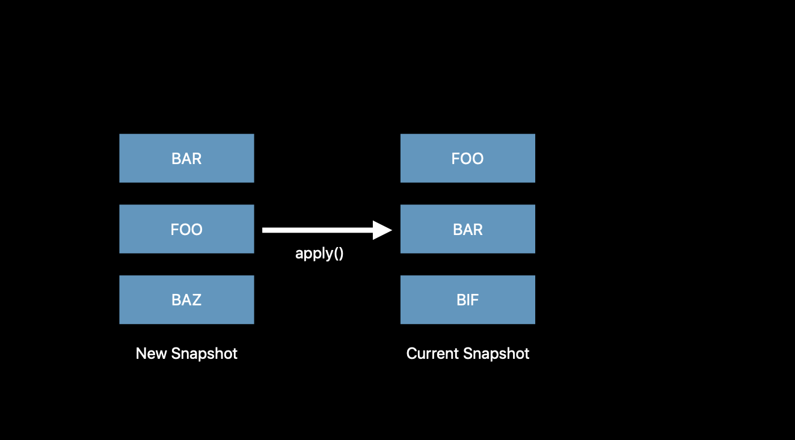

# Advances in UI Data Sources

Created: Jun 14, 2020 5:01 PM

## Where Is Our Truth?


우리의 데이터소스와 UI는 항상 동일해야함

그 접근법은 에러를 발생시킴

## A New Approach


## Snapshots

- Truth of UI state
- Unique identifiers for sections and items
- No more IndexPaths



UI State를 이제 snapshot으로 관리함

기존 snapshot을 복사하고 수정하다음 그걸 최종본으로 apply하면됨

우리는 이제 더이상 그리고 IndexPath로 약속하지 않아도 됨.

우리는 저 방식 대신 기존과 현재를 비교하고 바뀐것만 업데이트할 것임

하지만 식별할 수 있어야함, 우리는 이걸 Identifier로 알아낼 것임.

Hashable이 그래서 필수적으로 구현되야함

### Constructing Snapshots

Empty snapshot

```swift
let snapshot = NSDiffableDataSourceSnapshot<Section, UUID>()
```

Current data source snapshot copy

```swift
let snapshot = dataSource.snapshot()
```

### Snapshot State

```swift
var numberOfItems: Int { get }
var numberOfSections: Int { get }
var sectionIdentifiers: [SectionIdentifierType] { get }
var itemIdentifiers: [ItemIdentifierType] { get }
```

### Snapshot Configuration

```swift
func insertItems(
  _ identifier: [ItemIdentifierType],
  beforeItem beforeIdentifier: ItemIdentifierType
)

func moveItem(
  _ identifier: [ItemIdentifierType],
  afterItem afterIdentifier: ItemIdentifierType
)

func appendItems(
  _ identifier: [ItemIdentifierType],
  toSection afterIdentifier: SectionIdentifierType? = nil
)

func appendSections(_ identifier: [SectionIdentifierType],)
```

## Identifiers

- Must be unique
- Conform to Hashable
- Data model or identifier

```swift
struct MyModel: Hashable {

  let identifier = UUID()

	func hash(into hasher: inout Hasher) {
      hasher.combine(identifier)
  }

  static func == (lhs: MyModel, rhs: MyModel) -> Bool {
     return lhs.identifier == rhs.identifier
  }
}
```

근데 문제가 있지 않음?

dataSource 말고 indexPath를 사용하는 기존 API들이 있음

```swift
func collectionView(
	_ collectionView: UICollectionView,
	didSelectItemAt indexPath: IndexPath
) {
	if let identifier = dataSource.itemIdentifier(for: indexPath) {
			// Do something
	}
}
```

이렇게 identifier를 가져와서 사용할 수 있음

## Performance

- Fast
- Measure your app
- Safe to call `apply()`  from a background queue

⚠️ Caution

- Always call exclusively from the main queue or a background queue
- Framework will log or assert

메인 큐에서 호출하면, 오 그럼 diff는 background에서 계산해버림

그리고 다시 main으로 jump back함 .
