# Modern Swift API Design

Created: Jun 06, 2020 9:27 PM

## Clarity at the point of use

- No Prefixes in Swift-only Frameworks

Clarity at the point of use - 사용 관점에서의 명확함이 대따 중요함 명심하셈.

API 설계자의 가장 중요한 목표여야함.

좋은 네이밍과 가독성은 그래서 대따 중요함.


C, Objective-C는 모든 심볼이 글로벌 네임스페이스였음

그래서 우리는 Prefix를 사용했음

하지만! 스위프트의 모듈 시스템은 파일명에 앞에 모듈이름을 접두어로 붙여서 명확함

그니까 우린 Prefix안써도댐 ㅎ ㅡㅎ 그니까 덕지덕지 쓰지마셈.

## Values and references

간단히 하겠슴

- Prefer structs over classes
    - only choose classes when reference semantics are important
- Classes can make a good choice when
    - You need a reference counting and deinitialization
    - where there is a separte notion of "identity" from "equality"

왠만하면 struct 쓰셈

단지 reference semantics이 중요할 때만 class 쓰셈!

언제 class가 좋은 선택지 인 줄 아누??

바로! 

- reference counting이랑 deinitialization이 필요할 때!
- 동일성과 동등성을 구분짓고 싶을 때

단지 이때 뿐임 명심하셈

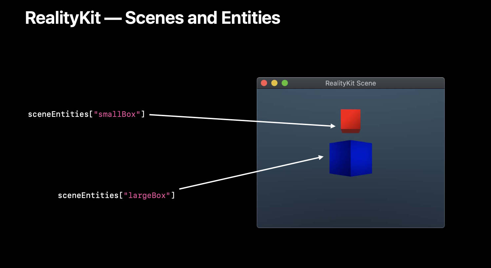

이건 RealityKit임 

RealityKit의 API는 엔터티라고 불르는 것들이 있음.

얘네는 identity를 가짐

우리는 Scene을 다룰 때 저 사물들을 막 수정하고 싶을 것임

우리는 저 Reality 엔진의 실제 오브젝트를 수정한다고 생각할 것임

이건 아주 좋은 reference 타입의 사용 예임

그러나 저 엔티티들의 속성들은 어떰?

그렇지 않음

요런건 struct 가 좋은 선택지임

자 코드를 보자구


박스를 만들고 attribute들을 지지고 볶을 것임.

우리는 Box에 다른 색을 줄것임 어떻게? material을 red색상으로 바꿈으로써 말이지

이 상황에서 Material이 Reference 타입이면 어떻게 될거 같음?

material을 생성하고, 이걸 사용해서 largeBox 생성 이후, 부분을 변경하고 다시 smallBox 생성할 것임

이 변화는 이전에 생성된 largeBox에 영향을 미침, 

이건 우리가 기대하던 바는 아닐 것임. 

우리는 이런 이유로 material을 value로 결정함.

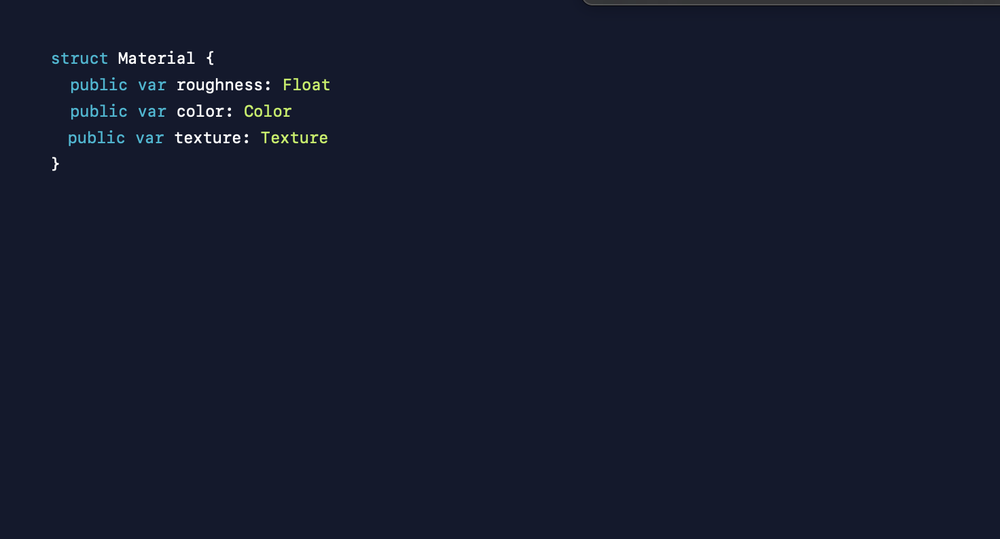

근데 이안에 Texture 보임? 요거에 대해 이야기 해볼것임

얘는 reference counting이 필요하다고 가정할 것임 그래서 class로 했음.

우리는 근데 이게 불변이 아닌 가변상태의 참조면 사용하는 입장에서 혼란스러울 것임

우리는 사용자입장에서 예상하는 작동방식을 고민하고 구현해야함.

Copy를 사용하는 방법으로 가능함

이를 미루어볼때 Texture는 value처럼 동작하기를 원함

하지만 레퍼런스 카운팅도 원함

이런걸 피하는 방법이있음

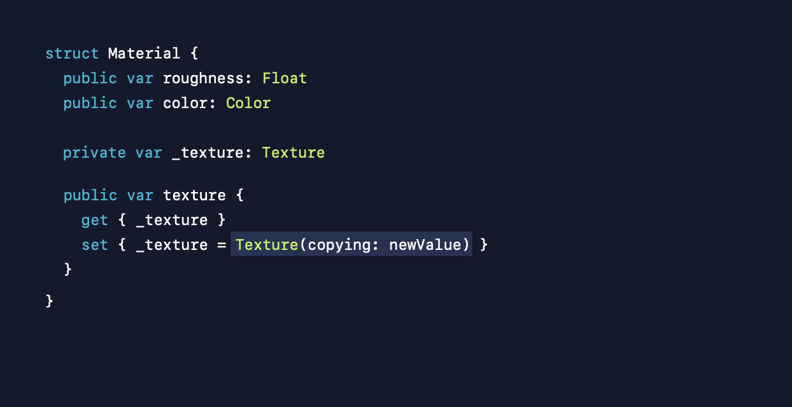

이렇게 defensive copy로 구현하는 것임

근데 이경우에는 get을 해온뒤 참조유형의 프로퍼티를 변경할 수 있음

후 그럼 다른 옵션을 생각해보자구

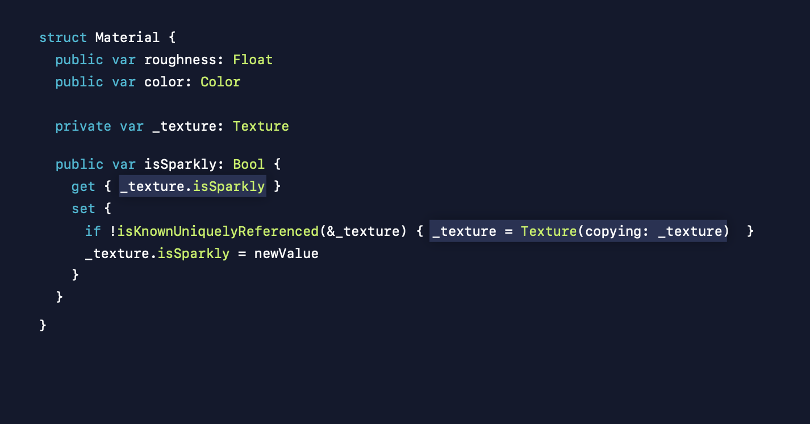

이렇게 실제 참조타입이 아니라 그 일부분만 공개하는 것임

그리고 그걸 설정했을 때 실제 텍스처를 복사한뒤 새로운 인스턴스에 설정을 해주는 것임 해결꿑

## Protocols and Generics

protocol은 class 뿐 아니라 struct enum에서도 사용 가능함

우리가 이제 제네릭을 사용해서 많은 타입이 공유하는 코드를 만들 수 있음.

swift는 protocol로 시작해! 

"start with a protocol" 라고 말할 수 있게됨

그말이 Xcode열고 바로 protocol치라는 말로 들림? 

ㄴ ㅡㄴ 착각임 그런 뜻이 아님

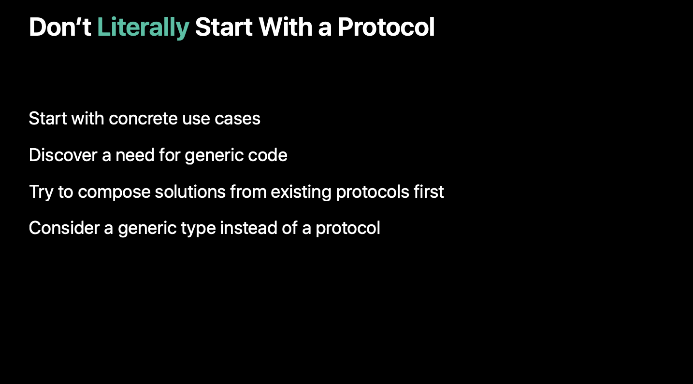

**일단은 concrete 타입으로 유즈케이스를 구현하셈**

그중에 이게 여러 타입에서 반복적인 코드가 있음?

그 **반복되며 공유하기를 원하는 제네릭한 코드를 찾으셈**

이 **공유하는 코드를 제네릭을 이용해서 구현해보셈**

그 다음 **기존에 존재하는 프로토콜들을 최대한 활용하려고 해보셈**

또 그 **프로토콜 대신 제네릭타입을 사용할려고 고민해보셈**

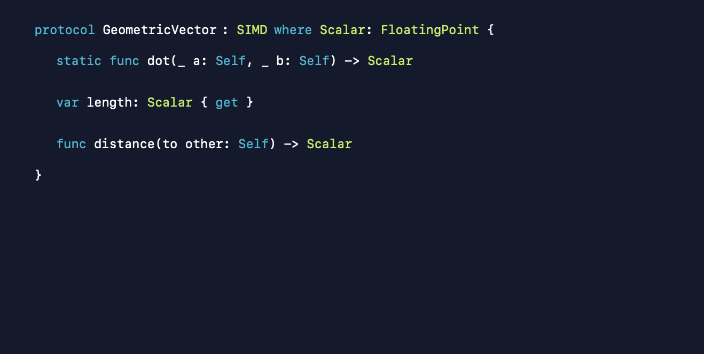

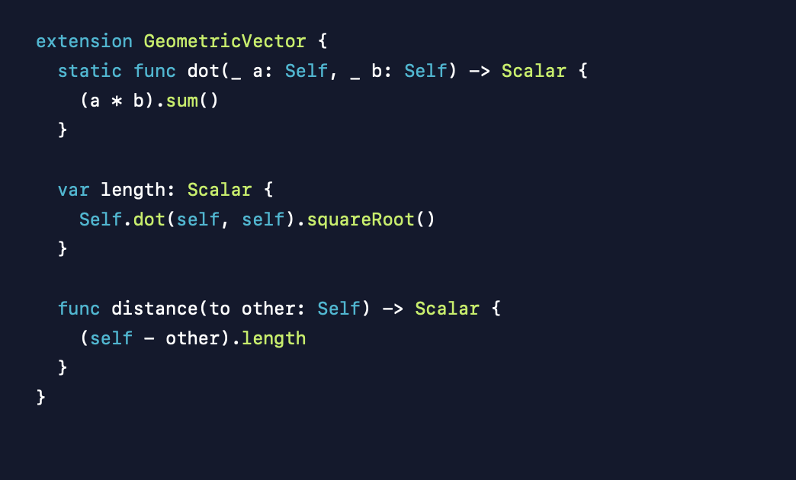

멋져보이지 않음?

근데 이게 문제임

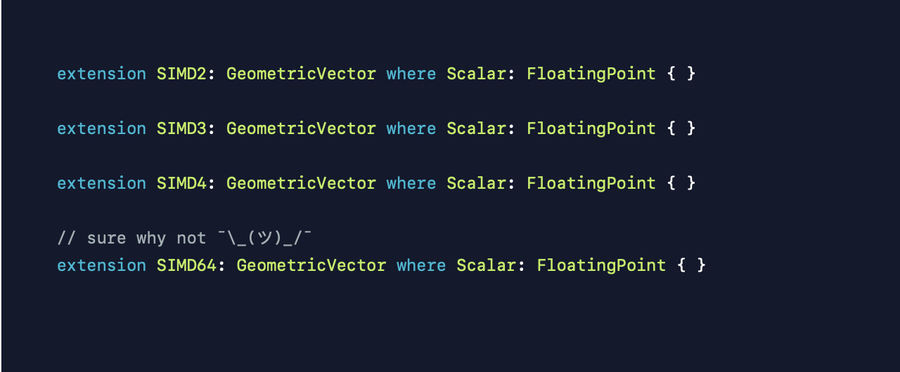

엄청 많은 타입들에 대해서 확장을 해야한다는 것임

차라리 이러면 되지 않음?

SIMD를 확장하는 거지

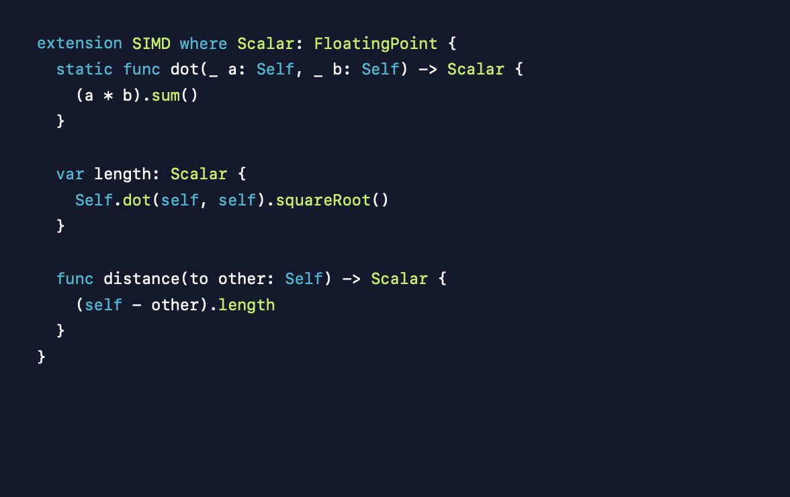

근데 이건 context of geometry가 아님!!

정말 FloatingPoint이기만하면 다 Geometric임

다시 생각해보셈

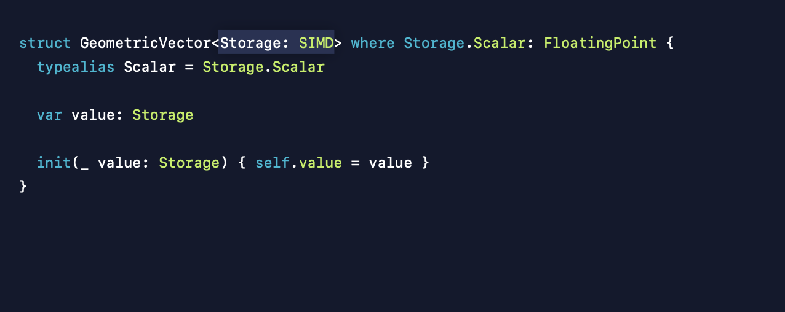

이런식으로 제네릭을 이용하은 방법으로 많은 부분이 해결가능함

### Key Path Member Lookup

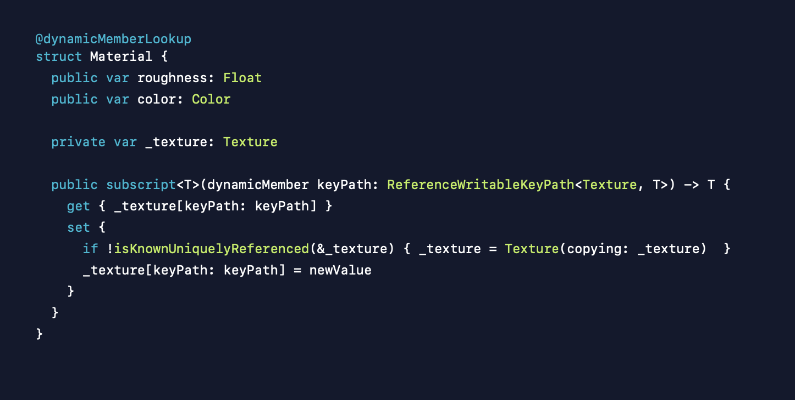

아까 있던 isSparkly만 공개했던 거 기억남?

@dynamicMemberLookup 애노테이션 한방이면 가능함

```swift
@dynamicMemberLookup
struct Material {
    
    private var _texture = Texture()
    
    public subscript<T>(dynamicMember keyPath: ReferenceWritableKeyPath<Texture, T>)-> T {
        get { _texture[keyPath: keyPath] }
        set {
            if !isKnownUniquelyReferenced(&_texture) { _texture = Texture(copying: _texture) }
            _texture[keyPath: keyPath] = newValue
        }
    }
}

let material = Material()
print(material.isSpark) // true
```

## Property Wrappers

Swift5 부터 추가된 API Property Wrapper에 대해 이야기해볼것임

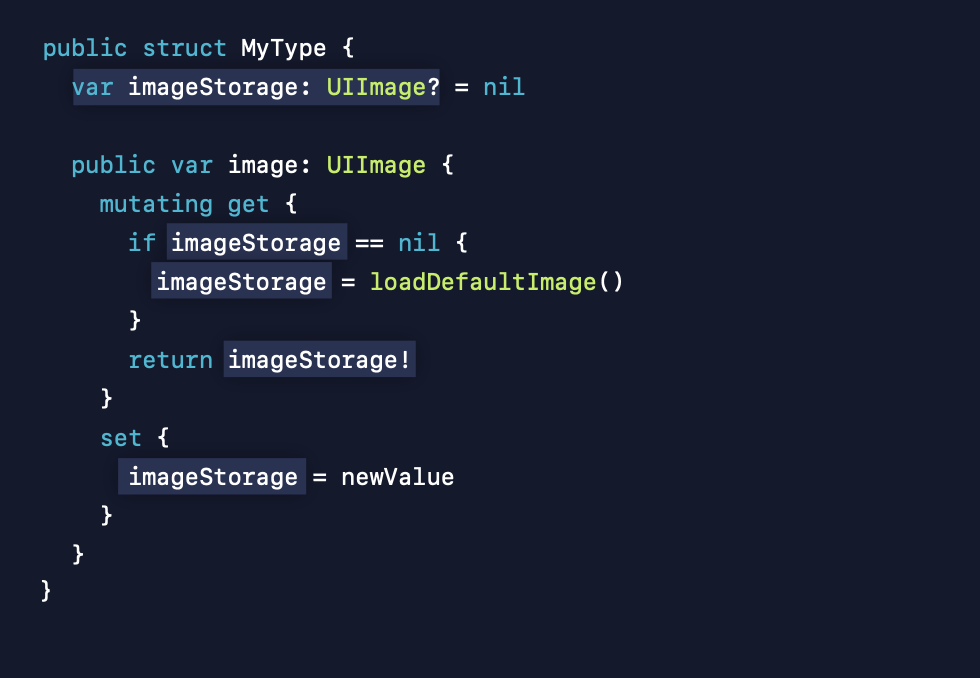

이미지가 있으면 가져오고 없으면 기본이미지를 보여주는 코드임

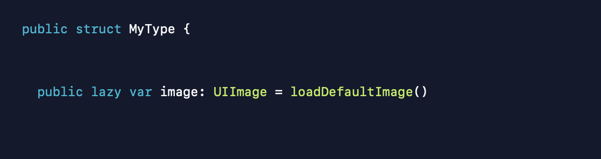

우린 이걸 lazy로 구현할 수 도 있슴

하지만 다른점은 초기화 정책에 대해서 정의하기 어렵다는 것임

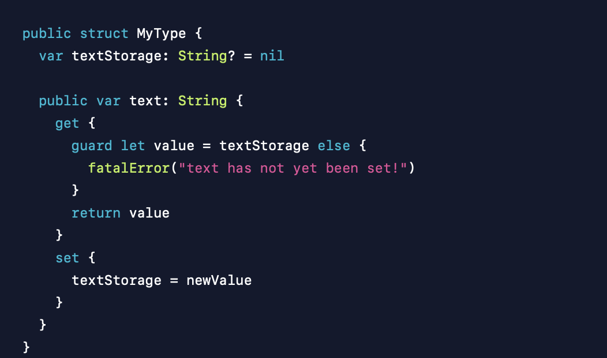

이렇게 에러를 떤지고 싶을 수 도 있지 않음?

이런 로직들 사실 엄청 중복됨

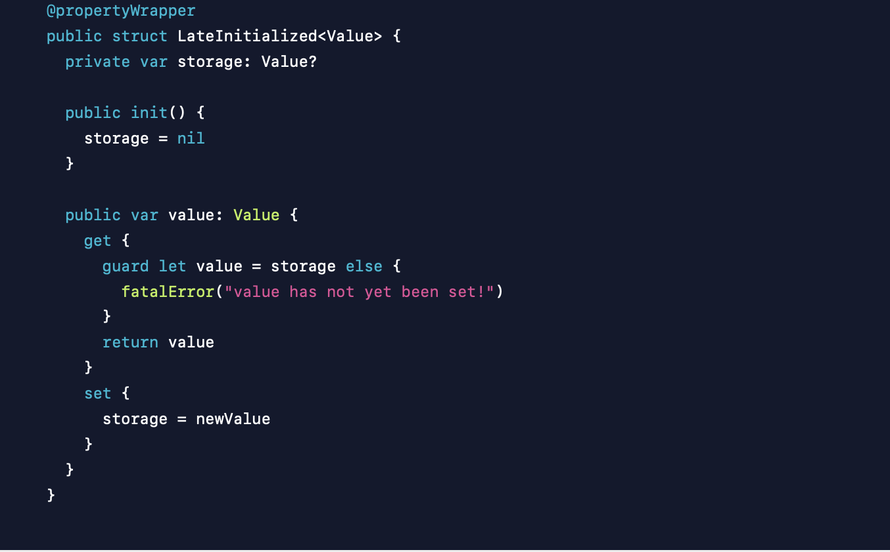

짜잔 propertyWrapper로 재사용할 수 있게됬음

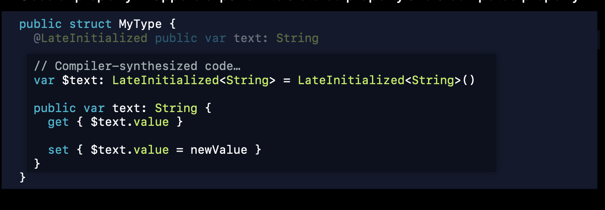

실제 컴파일러가 저렇게해줌 짱이지 않음?

$prefix는 래핑된 타입에 들어가는 것임

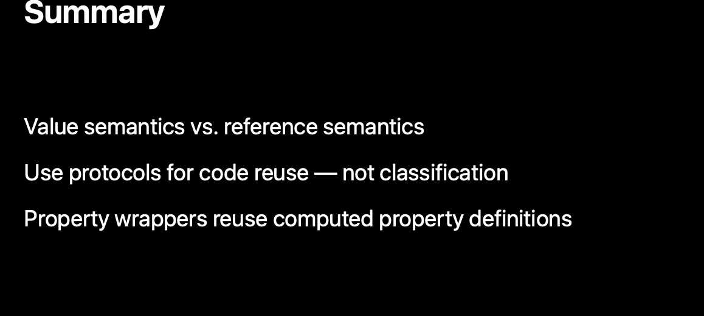
